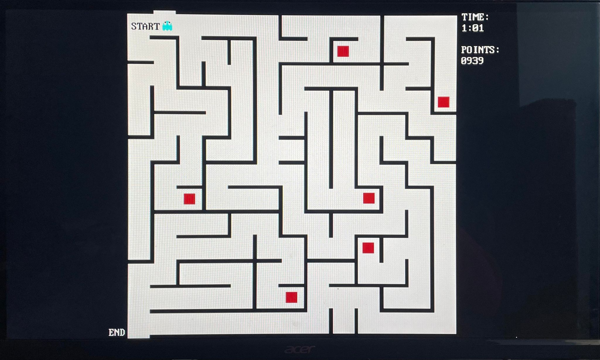

# ECE 4305 Final Project (TEAM 3)

## Project Description
For this final project, this system shall use the SPI protocol to communicate with the on-board accelerometer, PS2 to communicate with a mouse, and the video subsystem to display sprites and OSD's onto a monitor over VGA.

# Youtube Link
https://youtu.be/KbFIhe4pUgo

## Summary
This project is a tilt game, where the user will have to tilt the FPGA board to move the sprite on screen and avoid any walls.
Some rules of the game:
- You will start off the game with 1000 points
- Colliding with a wall will result in a deduction of points
- There are red bonus squares in the game, each awarding 100 points
- Each second used is a decrease in the number of points you have.
- To end the game, you must reach the end

Additional Information:
- Left click on a mouse will pause and unpause the game
- Right click on the mouse will reset the game

Parameters Met:
- Utilizes the SPI Core (communicating with accelerometer)
- Utilizes PS2 mouse for pause and unpause of the game
- Moving sprite is the object we are attempting to control
- Onscreen display text shows the time elapsed and your current score, as well as indicates when the game is over. 

## File Directory
- main.cpp
- collision_map.h
- readme.md
